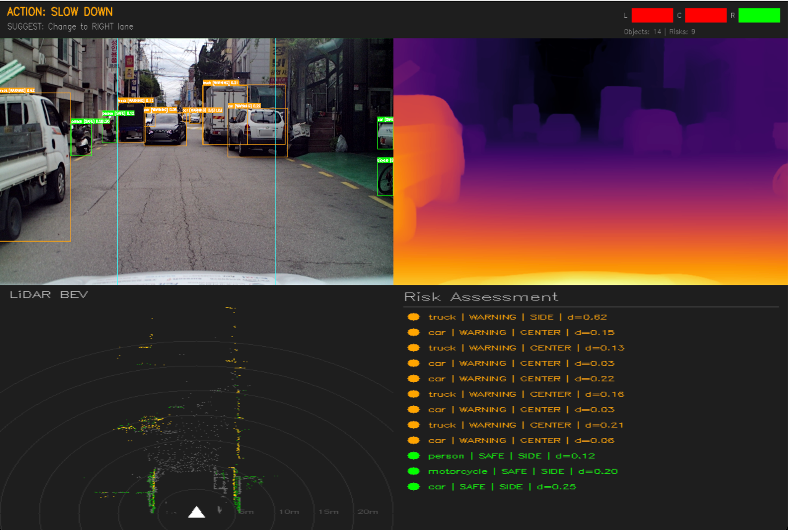
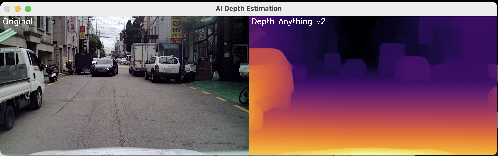
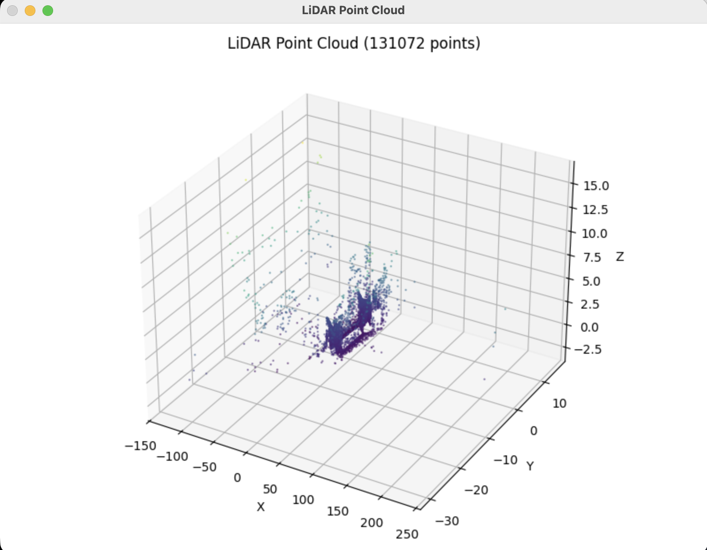
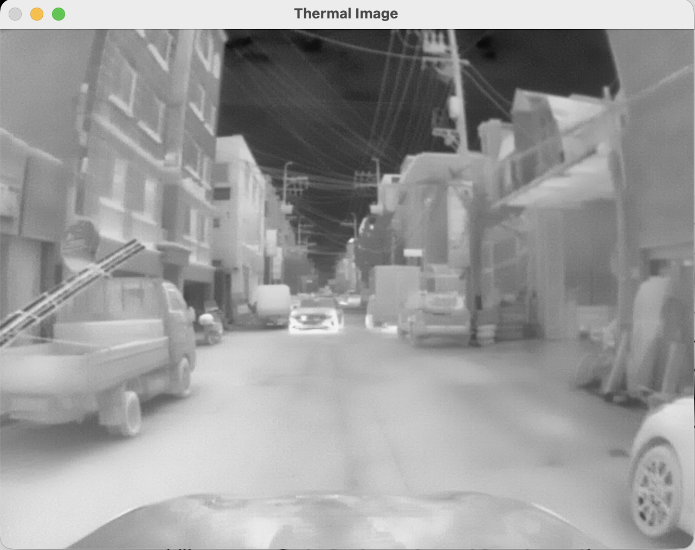

# AI-based Autonomous Driving Perception System

카메라, LiDAR, 열화상 센서 데이터를 활용한 AI 기반 자율주행 인지 시스템.
YOLO11과 Depth Anything v2를 결합하여 객체 인식, 깊이 추정, 위험도 판단, 차선 분석까지 수행하는 통합 파이프라인을 구현하였습니다.

## Overview

자율주행 차량이 주변 환경을 인식하기 위해서는 "무엇이 있는지(객체 인식)"와 "얼마나 먼지(깊이 추정)"를 동시에 파악해야 합니다.
본 프로젝트는 이 두 가지 핵심 과제를 AI 모델로 해결하고, 그 결과를 바탕으로 **위험도 판단 및 주행 의사결정**까지 수행합니다.

### 파이프라인
```
입력: 4방향 카메라(F/B/L/R) + LiDAR 포인트클라우드 + 열화상 카메라
                        ↓
        ┌───────────────┼───────────────┐
        ↓                               ↓
  YOLO11s                       Depth Anything v2
  (객체 탐지)                    (단안 깊이 추정)
  - 차량, 보행자, 이륜차          - 픽셀 단위 깊이맵
  - 신호등, 표지판 등             - 각 객체까지 상대 거리
        ↓                               ↓
        └───────────────┬───────────────┘
                        ↓
              위험도 판단 (Risk Assessment)
              - 객체별 DANGER / WARNING / SAFE
              - 차선 내 위치 분석 (좌/중/우)
              - LiDAR 최소 거리 보정
                        ↓
              주행 의사결정 (Driving Decision)
              - EMERGENCY BRAKE / SLOW DOWN / PROCEED
              - 차선 변경 제안
```

## Features

### 센서 융합 (Multi-sensor Fusion)
- **가시광 카메라 4방향** (전방/후방/좌측/우측, 1920x1080)
- **LiDAR** 포인트클라우드 (131,072 points)
- **열화상 카메라** (640x480)
- 각 센서의 데이터를 통합 분석하여 환경 인식 정확도 향상

### AI 객체 탐지 (Object Detection)
- **YOLO11s** (Ultralytics) 활용
- 차량(Car, Truck, Bus), 보행자(Adult, Kid), 이륜차, 킥보드 등 인식
- 신뢰도 기반 필터링 (threshold: 0.3)
- Ground Truth 라벨과 AI 인식 결과 비교 분석

### AI 깊이 추정 (Depth Estimation)
- **Depth Anything v2** (Vision Transformer 기반)
- 단안 카메라 이미지만으로 픽셀 단위 깊이맵 생성
- 각 감지된 객체의 상대적 거리 산출
- Apple Silicon MPS 가속 지원

### 위험도 판단 (Risk Assessment)
- 깊이값 기반 3단계 위험도: **DANGER** (>0.7) / **WARNING** (>0.4) / **SAFE**
- 차선 내 위치 분석: 자차 차선(CENTER) vs 측면(SIDE)
- 차선 내 위험 객체는 위험도 상향 조정
- 위험 객체 리스트 실시간 정렬 표시

### 주행 의사결정 (Driving Decision)
- **EMERGENCY BRAKE**: 차선 내 위험 객체 존재
- **SLOW DOWN**: 주의 필요 객체 감지
- **CLEAR - PROCEED**: 안전 확인
- 차선별 위험도 분석 → 차선 변경 방향 제안

### LiDAR Bird's Eye View
- 전방 포인트클라우드 탑뷰 시각화
- 높이 기반 색상 구분 (차량/사람/지면)
- 거리 그리드 표시 (5m 단위)

## Demo

### 자율주행 인지 시스템 (inference.py)


**화면 구성:**
- **좌상단**: 전방 카메라 + YOLO 객체 탐지 + 위험도 색상 표시 + 차선 가이드라인
- **우상단**: Depth Anything v2 깊이맵 (Inferno 컬러맵)
- **좌하단**: LiDAR Bird's Eye View (전방 포인트클라우드 탑뷰)
- **우하단**: Risk Assessment 리스트 (위험도 순 정렬)
- **상단 HUD**: 주행 판단 (ACTION) + 차선 제안 (SUGGEST) + 차선별 위험도 바

### 데이터셋 분석 (dataset_viewer.py)

#### AI 깊이 추정

*원본 이미지와 Depth Anything v2 깊이 추정 결과 비교*

#### LiDAR 3D 포인트클라우드

*차량 탑재 LiDAR 131,072개 포인트의 3D 시각화*

#### 열화상 카메라

*열화상 카메라 데이터 - 야간/저시정 환경 보완용*

## System Architecture

```
┌──────────────────────────────────────────────────────────┐
│                    Input Sensors                          │
│  ┌──────┐ ┌──────┐ ┌──────┐ ┌──────┐ ┌─────┐ ┌───────┐ │
│  │Cam F │ │Cam B │ │Cam L │ │Cam R │ │LiDAR│ │Thermal│ │
│  │1920x │ │1920x │ │1920x │ │1920x │ │131K │ │640x   │ │
│  │1080  │ │1080  │ │1080  │ │1080  │ │pts  │ │480    │ │
│  └──┬───┘ └──────┘ └──────┘ └──────┘ └──┬──┘ └───────┘ │
│     │                                    │               │
│     ▼                                    ▼               │
│  ┌─────────────────┐  ┌──────────────────────┐          │
│  │ YOLO11s         │  │ Depth Anything v2    │          │
│  │ - 14 classes     │  │ - ViT backbone       │          │
│  │ - bbox + conf    │  │ - pixel-wise depth   │          │
│  └────────┬────────┘  └──────────┬───────────┘          │
│           │                      │                       │
│           ▼                      ▼                       │
│  ┌────────────────────────────────────────┐              │
│  │         Fusion & Risk Assessment       │              │
│  │  - 객체별 깊이값 할당                    │              │
│  │  - 차선 내 위치 분석 (L/C/R)            │              │
│  │  - LiDAR 최소 거리 참조                 │              │
│  │  - 위험도 3단계 판정                     │              │
│  └────────────────┬───────────────────────┘              │
│                   ▼                                      │
│  ┌────────────────────────────────────────┐              │
│  │         Driving Decision               │              │
│  │  - EMERGENCY BRAKE / SLOW DOWN / GO    │              │
│  │  - 차선 변경 제안                       │              │
│  └────────────────────────────────────────┘              │
└──────────────────────────────────────────────────────────┘
```

## Project Structure

```
autonomous-driving-perception/
├── dataset_viewer.py      # 멀티센서 데이터셋 로드 + 시각화 + AI 분석
│                          # - 4방향 카메라 동시 표시
│                          # - LiDAR 3D 포인트클라우드 시각화
│                          # - GT 라벨 vs YOLO11 비교
│                          # - Depth Anything v2 깊이 추정
│                          # - 열화상 이미지 표시
│
├── inference.py           # 자율주행 인지 시스템 메인
│                          # - YOLO11 객체 탐지
│                          # - Depth Anything v2 깊이 추정
│                          # - 위험도 판단 + 차선 분석
│                          # - 주행 의사결정
│                          # - LiDAR BEV 시각화
│                          # - HUD 대시보드
│
├── requirements.txt       # 패키지 의존성
├── .gitignore
├── README.md
└── assets/
    ├── inference_result.png
    ├── depth_estimation.png
    ├── lidar_pointcloud.png
    └── thermal_view.png
```

## Installation

### 요구사항
- Python 3.10+
- macOS (Apple Silicon MPS) 또는 Linux (CUDA)

### 설치

```bash
# 1. Clone
git clone https://github.com/whichss/autonomous-driving-perception.git
cd autonomous-driving-perception

# 2. Conda 환경 생성
conda create -n perception python=3.10
conda activate perception

# 3. PyTorch 설치
conda install pytorch torchvision -c pytorch

# 4. 패키지 설치
pip install -r requirements.txt
```

### 데이터셋 준비
[AI Hub](https://aihub.or.kr/)에서 자율주행 데이터셋 샘플 다운로드 후 `~/Downloads/sample/` 경로에 배치

```
~/Downloads/sample/
├── 01.원천데이터/
│   ├── 가시광이미지/image_F,B,L,R/  (PNG)
│   ├── 라이다/                      (PCD)
│   ├── 열화상이미지/thermal/         (PNG)
│   └── 서브라벨링/                   (PNG, JSON)
└── 02.라벨링데이터/
    ├── 가시광이미지/image_F,B,L,R/  (JSON - COCO format)
    └── 서브라벨링/                   (JSON)
```

## Usage

### 1. 데이터셋 분석
```bash
python dataset_viewer.py
```
멀티센서 데이터를 한눈에 분석합니다.
- 4방향 카메라 뷰 동시 표시
- GT(Ground Truth) 라벨 vs YOLO11 인식 결과 비교
- AI 깊이 추정 시각화
- LiDAR 3D 포인트클라우드
- 열화상 이미지

### 2. 자율주행 인지 시스템
```bash
python inference.py
```
AI 모델을 활용한 통합 인지 시스템을 실행합니다.
- 전방 카메라 객체 탐지 + 위험도 표시
- 깊이 추정 컬러맵
- LiDAR Bird's Eye View
- 위험 객체 리스트
- 주행 판단 HUD (감속/정지/진행 + 차선 변경 제안)

## AI Models

| Model | Task | Architecture | Paper |
|-------|------|-------------|-------|
| **YOLO11s** | Object Detection | CNN-based single-stage detector | [Ultralytics](https://docs.ultralytics.com/) |
| **Depth Anything v2** | Monocular Depth Estimation | DINOv2 + DPT (Vision Transformer) | [arXiv:2406.09414](https://arxiv.org/abs/2406.09414) |

## Dataset

[AI Hub 자율주행 인지 데이터셋](https://aihub.or.kr/) 활용

| Sensor | Format | Resolution | Description |
|--------|--------|-----------|-------------|
| 가시광 카메라 (F/B/L/R) | PNG | 1920 x 1080 | 차량 4방향 촬영 |
| LiDAR | PCD | 131,072 points | 차량 탑재 3D 스캐너 |
| 열화상 카메라 | PNG | 640 x 480 | 적외선 열화상 |
| 라벨링 | JSON (COCO) | Bbox + Segmentation | 객체 어노테이션 |

### 라벨 카테고리
| 분류 | 객체 |
|------|------|
| **Vehicle** | Car, TruckBus, Two-wheel Vehicle, Personal Mobility |
| **Pedestrian** | Adult, Kid Student |
| **Outdoor** | Traffic Sign, Traffic Light, Speed Bump, Crosswalk, Parking Space |

## Results

### inference.py 분석 결과 (샘플 데이터)
- **감지 객체**: 14개 (truck, car, person, motorcycle, bicycle)
- **위험 객체**: 9개 (WARNING 등급)
- **주행 판단**: SLOW DOWN
- **차선 제안**: Change to RIGHT lane
- **LiDAR 전방 최소 거리**: 측정값 기반 보조 판단

## Future Work

- [ ] 풀 데이터셋 학습 (현재 샘플 데이터로 파이프라인 검증 완료, 전체 데이터 1TB 확보 예정)
- [ ] YOLO fine-tuning (AI Hub 라벨 데이터 기반 도메인 특화 학습)
- [ ] LiDAR-Camera 캘리브레이션 (정확한 깊이 융합)
- [ ] 다중 프레임 객체 추적 (Temporal Tracking)
- [ ] ROS2 연동 (실시간 로봇 시스템 배포)
- [ ] 캠퍼스 규모 3D World Model 구축

## References

- [Depth Anything v2](https://github.com/DepthAnything/Depth-Anything-V2) - Monocular Depth Estimation
- [YOLO11 (Ultralytics)](https://github.com/ultralytics/ultralytics) - Real-time Object Detection
- [Seoul World Model (Naver AI)](https://seoul-world-model.github.io/) - City-scale World Simulation
- [AI Hub](https://aihub.or.kr/) - Korean Public AI Dataset

## License

MIT License
